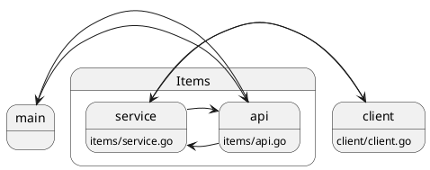

# samplesdk

## Flow

```plantuml
@startuml
  state main
  state Items {
    state api:items/api.go
    state service:items/service.go
  }
  state client:client/client.go

  main -> api
  api -> service
  service -> client

  client -> service
  service -> api
  api -> main
@enduml
```
